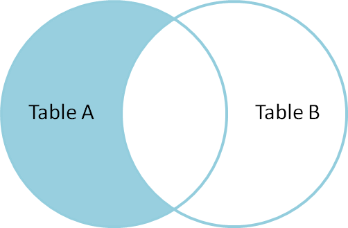
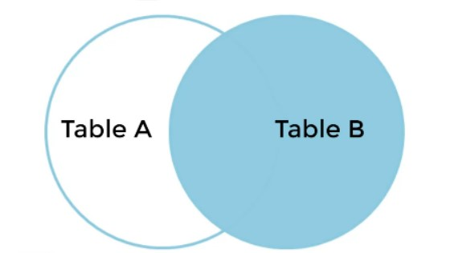
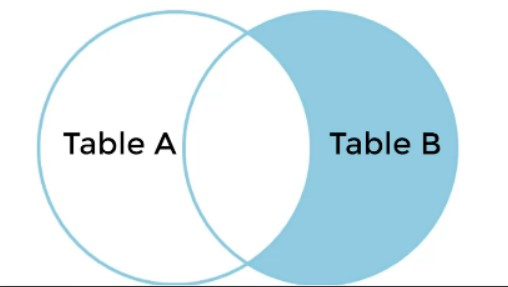
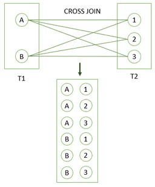

# PostgreSQL Basics

<details>
  <summary> Managing Database : [ SHOW | CREATE | DROP | BACKUP | RESTORE | RENAME | COPY ] : Database </summary>
<br><br>  

| Command    | Description |  
| ----------- | ----------- |  
|**SHOW DATABASES;**   | To see the list of all the databases on the sql server.      |  
|**CREATE DATABASE database_name ;**  |  To create a new database.|  
|**DROP DATABASE database_name ;** | To drop the entire database |  
|**BACKUP DATABASE ;** |🤷 |  
|**RESTORE DATABASE ;** |🤷 |  
|**RENAME DATABASE ;** |🤷 |   
|**COPY DATABASE ;** |🤷 |   

<br>  

</details>

<details>
  <summary> Database Definition: [ CREATE ] : Table </summary>
<br><br>

| Command | Description |
| ----------- | ----------- |  
|**CREATE TABLE** table_name ( <br>  column_name_1 data_type (size) NULL/ NOT NULL , <br> column_name_2 data_type (size) NULL/ NOT NULL ,<br> column_name_3 data_type (size) NULL/ NOT NULL , <br>... ... ...<br>... ... ...<br>PRIMARY KEY(column_name/s) ,<br> CONSTRAINT fk_name FOREIGN KEY (Column_Name/s) REFERENCES referenced_table_name(referenced_column_Name/s) ON DELETE CASCADE ON UPDATE CASCADE , <br>... ... ...<br>... ... ...<br>); |  To Create a Table with Primary key and Foreign Keys.<br> <br>**For example:** <br>create table personal( <br>id int, <br>name varchar(50),<br>birth_date date, <br>phone varchar(12), <br>gender varchar(1));<br> <br><b><u>NOTE:</u> Each Table can have only one Primary Key which may consist of one or more than one Columns. But a table/relation may have multiple Foreign Key.In Case of, Foreign Key declaration, referenced Column have to be Primary Key in referenced table/relation.|  
</details>

<details>
<summary> Modifying Database : [ INSERT INTO ] : Table </summary>
  
<br><br>
  
| Command    | Description |
| ----------- | ----------- |  
|<b>INSERT INTO table_name VALUES <br>(value1,value2,value3,... ...),<br>(value1,value2,value3,... ...), <br>(value1,value2,value3,... ...), <br>... ... ; <b>| TO add values for all the columns of the table.<br><br> No need to specify the column names in the SQL syntax. <br><br> But need to make sure the order of the values is in the same order as the columns in the table.|
|<b>INSERT INTO table_name <br>(column1, column2, column3,... ...) VALUES <br>(value1,value2,value3,... ...), <br>(value1,value2,value3,... ...) , <br>(value1,value2,value3,... ...),<br> ... ... ; <b>|To insert Data Only in Specified Columns.|
  <br>

  <br> 
</details>
<details>
  <summary>Execution Order : [ SELECT with all clause] </summary>

## Execution Order
PostgreSQL evaluates the select statements with all clause as follows:   
``FROM`` -> ``WHERE`` -> ``GROUP BY`` -> ``HAVING`` -> ``SELECT`` -> ``DISTINCT`` -> ``ORDER BY`` -> ``LIMIT``
</details>
<details>
  <summary>Querying Data : [ SELECT | SELECT DISTINCT | Column Alias ] : Table </summary>

## SELECT 
The **SELECT** statement has the following clauses:
  - Select distinct rows using **DISTINCT** operator.
  - Sort rows using **ORDER BY** clause.
  - Filter rows using **WHERE** clause.
  - Select a subset of rows from a table using **LIMIT or FETCH** clause.
  - Group rows into groups using **GROUP BY** clause.
  - Filter groups using **HAVING** clause.
  - Join with other tables using joins such as **INNER JOIN**, **LEFT JOIN**, **FULL OUTER JOIN**, **CROSS JOIN** clauses.
  - Perform set operations using **UNION**, **INTERSECT**, and **EXCEPT** 

In this section, we will focus on **SELECT** and **FROM** clause.

  | Command    | Description |
  | ----------- | ----------- |  
  | **SELECT** select_list <br> **FROM** table_name | General statement for basic query <br> <b>Note : <b> Where clause is optional| 
  | **SELECT** **DISTINCT** column1 <br>**FROM** table_name; | Removes duplicate rows from a result set |
  | **SELECT** **DISTINCT** column1, column2 <br>**FROM** table_name; | Removes duplicate rows from a result set. <br>It uses the combination of values in both column1 and column2 columns for evaluating the duplicate. |
  | **SELECT** column_name **AS** alias_name <br> **FROM** table_name <br><br> Or, <br><br> **SELECT** column_name alias_name <br> **FROM** table_name | The column_name is assigned an alias alias_name. <br>The **AS** keyword is optional so we can omit it like later command.<br>Both command will work as same |
  | **SELECT** expression **AS** alias_name <br>**FROM** table_name; | |

**Note:**  
- select list that can be a column or a list of columns in a table from which we want to retrieve data. If we specify a list of columns, we need to place a comma (,) between two columns to separate them. If we want to select data from all the columns of the table, we can use an asterisk (*) shorthand instead of specifying all the column names. The select list may also contain expressions or literal values.
- The FROM clause is optional. If we are not querying data from any table, we can omit the FROM clause in the SELECT statement.
- The **DISTINCT** keyword operates on column(s)
- If a column alias contains one or more spaces, we need to surround it with double quotes. ( ```column_name AS "alias name"```)

**Execution Order:**  
PostgreSQL evaluates the FROM clause before the SELECT clause in the SELECT statement: FROM -> SELECT

**Examples:**  
Find the first names of all customers from the customer table:
```PostgreSQL
SELECT first_name
FROM customer;
```
Retrieve first name, last name, and email of customers:
```PostgreSQL
SELECT first_name, last_name, email
FROM customer;
```
Retrieve data from all columns of the customer table:
```PostgreSQL
SELECT *
FROM customer;
```
To find distinct values of all columns in a table:
```PostgreSQL
SELECT DISTINCT *
FROM table_name;
```
Retrieve first name, last name of customers where the last need to be shown as surname:
```PostgreSQL
SELECT first_name, last_name AS surname
FROM customer;
```
Retrieve full_name of customers using first name, last name:
```PostgreSQL
SELECT first_name || ' ' || last_name AS full_name
FROM customer;
```
Or, 
```PostgreSQL
SELECT first_name || ' ' || last_name AS "full name"
FROM customer;
```
</details>

<details>
  <summary>Querying Data : [ ORDER BY ] : Table </summary>
    
  | Command | Description |
  | --- | --- |  
  | **SELECT** select_list <br>**FROM** table_name <br> **ORDER BY**  <br>sort_expression1 **ASC/DESC** , <br> sort_expression2 **ASC/DESC** | The ORDER BY clause allows to sort rows returned by a SELECT clause in ascending or descending order based on a sort expression | 
  | **ORDER BY** sort_expresssion [ASC or DESC] [NULLS FIRST or NULLS LAST] | In the database world, NULL is a marker that indicates the missing data or the data is unknown at the time of recording. When we sort rows that contain NULL, we can specify the order of NULL with other non-null values by using the NULLS FIRST or NULLS LAST option of the ORDER BY clause <br> <br> The **NULLS FIRST** option places NULL before other non-null values and the **NULL LAST** option places NULL after other non-null values. |

  **Execution Order:**  
  PostgreSQL evaluates the clauses in the SELECT statement in the following order: ``FROM``, ```SELECT```, and ```ORDER BY```  

  **Note:** 
  - Use **ASC** to sort in **ascending** order.
  - Use **DESC** to sort in **descending** order.
  - If we leave it blank, **ORDER BY** uses **ASC** by **default**.
  - By default, **ASC** use NULLS LAST
  - By default, **DESCSC** use NULLS FIRST

  **Example:**   
  Sort customers by their first names in ascending order:
  ```PostgreSQL
  SELECT first_name, last_name 
  FROM customer
  ORDER BY first_name ASC;
  ```
  OR, 
   ```PostgreSQL
  SELECT first_name, last_name 
  FROM customer
  ORDER BY first_name;
  ```
  
  ```PostgreSQL
  SELECT store_id, first_name, last_name 
  FROM customer
  ORDER BY store_id DESC, first_name ASC;
  ```
  Find store_id, first name and last name of all the customer ordered in descended value of store_id:
  ```PostgreSQL
  SELECT store_id, first_name, last_name 
  FROM customer
  ORDER BY store_id DESC;
  ```
  
  ```PostgreSQL
  SELECT num 
  FROM sort_demo 
  ORDER BY num NULLS FIRST;
  ```

  ```PostgreSQL
  SELECT num 
  FROM sort_demo 
  ORDER BY num DESC NULLS LAST;
  ```
</details>

<details>
  <summary>Filtering Data : [ WHERE ] : Table </summary>

## WHERE
  | Command | Description |
  | ----- | ----- | 
  | **SELECT** select_list <br> **FROM** table_name <br>**WHERE** condition; | In this syntax, we place the **WHERE** clause right after the FROM clause of the SELECT statement.<br>The **WHERE** clause uses the condition to filter the rows returned from the SELECT clause. <br>The condition is a boolean expression that evaluates to true, false, or unknown. <br>The query returns only rows that satisfy the condition in the WHERE clause.|

  **Execution Order**  
  PostgreSQL evaluates the WHERE clause after the FROM clause but before the SELECT and ORDER BY clause. i.e., from -> where -> select -> order by

  **Example**  
  To find customers with the first name is Jamie:
  ```PostgreSQL
  SELECT customer_id, first_name
  FROM customer
  WHERE first_name = 'Jamie';
  ```

  To find customers whose first name and last names are Jamie and rice:
  ```PostgreSQL
  SELECT customer_id, first_name, last_name
  FROM customer
  WHERE first_name = 'Jamie' AND last_name = 'rice';
  ```
  To find the customers with first names having any of the following Ann, Anne, and Annie:
  ```PostgreSQL
  SELECT customer_id, first_name, last_name
  FROM customer
  WHERE first_name IN ('Ann', 'Anne', 'Annie');
  ```
  Find customers whose first names start with Br and last names are not Motley:
  ```PostgreSQL
  SELECT customer_id, first_name, last_name
  FROM customer
  WHERE first_name like 'Br%'
      AND last_name <> 'Motley';
  ```
</details>

<details>
  <summary>Filtering Data : [ AND | OR ] : Table </summary>

## AND & OR
AND operator – combine two boolean expressions and return true if both expressions evaluate to true. <br>
OR operator – combine two boolean expressions and return false if either expression evaluates to false.

In PostgreSQL, a boolean value can have one of three values: true, false, and null.

PostgreSQL uses ``true``, ``'t'``, ``'true'``, ``'y'``, ``'yes'``, ``'1'`` to represent true and ``false``, ``'f'``, ``'false'``, ``'n'``, ``'no'``, and ``'0'`` to represent false.

A boolean expression is an expression that evaluates to a boolean value.

For example, the expression 1=1 is a boolean expression that evaluates to true:
```PostgreSQL
SELECT 1 = 1 AS result;
```
**Explanation of AND operator:**  
The basic syntax of the AND operator:
```Postgresql
expression1 AND expression2
```
In this syntax, expression1 and expression2 are boolean expressions that evaluate to true, false, or null.

The AND operator returns true only if both expressions are true. It returns false if one of the expressions is false. Otherwise, it returns null.

The following table shows the results of the AND operator when combining true, false, and null.
| true | false | null | ANDed Result |
| --- | --- | --- | --- |
| true | false | null | true |
| false | false | false | false |
| null | false | null | null |

Find the films that have a length greater than 180 and a rental rate less than 1:
```Postgresql
SELECT title, length, rental_rate
FROM film
WHERE length > 180 AND rental_rate < 1;
```
**Explanation of OR Operator:**
The basic syntax of the OR operator:
```Postgresql
expression1 OR expression2
```
In this syntax, expression1 and expression2 are boolean expressions that evaluate to ``true``, ``false``, or ``null``.

The OR operator returns true only if any of the expressions is true. It returns false if both expressions are false. Otherwise, it returns null.

The following table shows the results of the AND operator when combining true, false, and null.
| true | false | null | ANDed Result |
| --- | --- | --- | --- |
| true | true | true | true |
| true | false | null | false |
| true | null | null | null |

Find the films that have a rental rate is 0.99 or 2.99
```PostgreSQL
SELECT title, rental_rate
FROM film
WHERE rental_rate = 0.99 OR rental_rate = 2.99;
```
</details>
<details>
  <summary>Filtering Data : [ LIMIT | OFFSET | FETCH ] : Table </summary>  


## LIMIT & OFFSET 
  | Command | Description |
  | --- | --- |
  | **SELECT** select_list<br>**FROM** table_name <br> **ORDER BY** sort_expression <br> **LIMIT** row_count | The statement returns row_count rows generated by the query. <br> If the row_count is zero, the query returns an empty set. <br> If the row_count is NULL, the query returns the same result set as it does not have the LIMIT clause. |
  | **SELECT** select_list<br>**FROM** table_name <br> **ORDER BY** sort_expression <br> **LIMIT** row_count <br> **OFFSET** row_to_skip; | The statement first skips row_to_skip rows before returning row_count rows generated by the query. <br> If the row_to_skip is zero, the statement will work like it doesn’t have the OFFSET clause. <br> It’s important to note that PostgreSQL evaluates the OFFSET clause before the LIMIT clause. |  

  **Note**
  - PostgreSQL stores rows in a table in an unspecified order, therefore, when we use the LIMIT clause, we should always use the ORDER BY clause to control the row order.
  - If we don’t use the ORDER BY clause, we may get a result set with the rows in an unspecified order.

  **Examples**  
  The following statement uses the **LIMIT** clause to get the first five films sorted by film_id:
  ```PostgreSQL
  SELECT film_id, title, release_year 
  FROM film 
  ORDER BY film_id 
  LIMIT 5;
  ```
  To retrieve 4 films starting from the fourth one ordered by film_id, we can use both LIMIT and OFFSET clauses as follows:
  ```PostgreSQL
  SELECT film_id, title, release_year 
  FROM film 
  ORDER BY film_id 
  LIMIT 4
  OFFSET 3;
  ```

## FETCH
- To skip a certain number of rows and retrieve a specific number of rows, we often use the ``LIMIT`` clause in the ``SELECT`` statement. However, the LIMIT clause is not a ``SQL`` standard.
- To conform with the SQL standard, PostgreSQL supports the ``FETCH`` clause to skip a certain number of rows and then fetch a specific number of rows.

The basic syntax of FETCH clause:
```PostgreSQL
OFFSET row_to_skip { ROW | ROWS }
FETCH { FIRST | NEXT } [ row_count ] { ROW | ROWS } ONLY
```
In this syntax:
- First, specify the number of rows to skip (``row_to_skip``) after the ``OFFSET`` keyword. The start is an integer that is zero or positive. It defaults to 0, meaning the query will skip no rows.
  - If the ``row_to_skip`` is higher than the number of rows in the table, the query will return no rows.
- Second, provide the number of rows to retrieve (``row_count``) in the ``FETCH`` clause. The ``row_count`` must be an integer 1 or greater. The ``row_count`` defaults to 1.

**Note:**  
- The ``ROW`` is the synonym for ``ROWS``, ``FIRST`` is the synonym for ``NEXT`` so we can use them interchangeably.
- Because the table stores the rows in an unspecified order, we should always use the ``FETCH`` clause with the ``ORDER BY`` clause to make the order of rows consistent.
- ``OFFSET`` clause must come before the ``FETCH`` clause in SQL:2008. However, ``OFFSET`` and ``FETCH`` clauses can appear in any order in PostgreSQL.

Select first film sorted by titles in ascending order:
```PostgreSQL
SELECT film_id, title
FROM film
ORDER BY title
FETCH FIRST ROW ONLY;
```
Select first five films sorted by titles in ascending order:
```PostgreSQL
SELECT film_id, title
FROM film
ORDER BY title
FETCH FIRST 5 ROWS ONLY;
```
Find the next five films after the first five films sorted by titles:
```PostgreSQL
SELECT film_id, title
FROM film
ORDER BY title
OFFSET 5 ROWS
FETCH FIRST 5 ROWS ONLY;
```
</details>

<details>
  <summary>Filtering Data : [ IN | BETWEEN ] : Table </summary>

### `IN Operator`
The ``IN`` operator allows to check whether a value matches any value in a list of values.

The basic syntax of the ``IN`` operator:

```PostgreSQL
value IN (value1,value2,...)
```
The ``IN`` operator returns ``true`` if the value is equal to any value in the list such as ``value1``, ``value2``, ...

Retrieve information about the film with id 1, 2, and 3:
```PostgreSQL
SELECT film_id, title
FROM film
WHERE film_id IN (1,2,3);
```
Find the actors who have the last name in the list 'Allen', 'Chase', and 'Davis':
```PostgreSQL
SELECT first_name, last_name
FROM actor
WHERE last_name IN ('Allen', 'Chase', 'Davis' )
ORDER BY last_name;
```
Find payments whose payment dates are in a list of dates: 2007-02-15 and 2007-02-16:
```PostgreSQL
SELECT payment_id, amount, DATE(payment_date)
FROM payment
WHERE payment_date::date IN ('2007-02-15', '2007-02-16');
```

### `BETWEEN Operator`
The `BETWEEN` operator allows to check if a value falls within a range of values.
| Command | Description |
| --- | --- | 
| value ``BETWEEN`` low ``AND`` high | If the ``value`` is greater than or equal to the ``low`` value and less than or equal to the ``high`` value, the ``BETWEEN`` operator returns true; <br> Otherwise, it returns false. <br> The syntax can be re-written as ``value`` >= low ``AND`` ``value`` <= high | 

**Note:**  
- When using BETWEEN operator with dates that also include timestamp information, we need to pay careful attention to using BETWEEN versus <=, >= comparison operators, due to the fact that a datetime starts at 0:00. Later on we will study more specific methods for datetime information types.
Retrieve payments with payment_id is between 17503 and 17505:
```PostgreSQL
SELECT payment_id, amount
FROM payment
WHERE payment_id BETWEEN 17503 AND 17505;
```
Find payments with payment_id is not the range between 17503 and 17505:
```PostgreSQL
SELECT payment_id, amount
FROM payment
WHERE payment_id NOT BETWEEN 17503 AND 17505;
```
Find payments whose payment dates are between 2007-02-15 and 2007-02-20 and amount more than 10:
```PostgreSQL
SELECT payment_id, amount, payment_date
FROM payment
WHERE payment_date BETWEEN '2007-02-15' AND '2007-02-20'
  AND amount > 10
ORDER BY payment_date;
```
</details>
<details>
  <summary>Filtering Data : [ LIKE | ILIKE] : Table </summary>

## LIKE Operator
The ``LIKE`` (and ``ILIKE``) operator allows us to perform pattern matching against string data with the use of wildcard characters:
- Percent % 
  - Matches any sequence of characters
- Underscore _
  - Matches any single character
**Syntax**  
```PostgresSQL
value LIKE pattern
value NOT LIKE pattern
value ILIKE pattern
VALUE NOT ILIKE pattern
```
**Note:**
- ``LIKE`` is case-sensitive
- ``ILIKE`` is case-insensitive  

**Some Pattern**
- "a%" = words ``start`` with a
- "%a" = words ``end`` with a
- "%test%"= words that have ``test`` in any position
- "_r%" = words that have "r" in the 2nd position from beginning
- "a_%" = words start with 'a' and it at least have 1 char after 'a'.
- "a_ _%" = words start with 'a' and it at least have 2 char after 'a'.
- "a%o"= Strings that start with "a" and ends with "o"
- [_ _ _] matches any string of exactly three characters.
- [_ _ _ %] matches any string of at least three characters.

Find customers whose first names contain the string ``er`` :
```PostgreSQL
SELECT first_name, last_name
FROM customer
WHERE first_name LIKE '%er%'
ORDER BY first_name;
```

### What if we want to match the character % or _ itself:
Then, The solution is use ESCAPE option.

For example, a column of table contains info like:  
The rents are now 10% higher than last month    


To match the % or _ itself, ESCAPE should be used.

(Read from o)

</details>

<details>
  <summary>Filtering Data : [ IS NULL ] : Table </summary>

## NULL
NULL means missing information or not applicable. NULL is not a value, therefore, we cannot compare it with other values like numbers or strings.

The comparison of NULL with a value will always result in NULL. Additionally, NULL is not equal to NULL so the following expression returns NULL:
```PostgreSQL
SELECT null = null AS result;
```

## IS NULL
To check if a value is NULL or not, we cannot use the equal to (``=``) or not equal to (``<>``) operators.`Instead, we use ``IS NULL`` or ``IS NOT NULL`` operator
```PostgreSQL
value IS NULL
---------------
value IS NOT NULL
```
- The IS ``NULL`` operator returns true if the ``value`` is NULL or false otherwise.
- The ``IS NOT NULL`` operator returns true if the ``value`` is not NULL or false otherwise.

Find the addresses from the address table that the address2 column contains NULL:
```PostgreSQL
SELECT address, address2
FROM address
WHERE address2 IS NULL;
```
Retrieve the address that has the address2 not NULL:
```PostgreSQL
SELECT address, address2
FROM address
WHERE address2 IS NOT NULL;
```
</details>

<details>
  <summary>Joining Tables : [ TABLE ALIAS | INNER JOIN | FULL OUTER JOIN | LEFT JOIN | RIGHT JOIN | SELF JOIN | CROSS JOIN | NATURAL JOIN] </summary>

## Table Alias
A table alias is a feature in SQL that allows to assign a temporary name to a table during the execution of a query.
| Command | Description | 
| --- | --- | 
| table_name AS alias_name | It will renamed the name of the table "table_name" to "alias_name" |

**Note:**  
- The AS keyword is optional, meaning that we can omit it like this: ```table_name alias_name```

To retrieve five titles from the ``film`` table:
```PostgreSQL
SELECT f.title
FROM film AS f
ORDER BY f.title
LIMIT 5;
```
## Inner Join 

| Command | Description |
| --- | --- | 
| **SELECT** select_list <br>**FROM** TableA **INNER JOIN** TableB <br>**ON** TableA.column_name = TableB.column_name; | Inner join produces only the set of records that match in both TableA and TableB based on the column name. |

  
**Note:**   
- To make the query shorter, we can use table aliases:
  ```PostgreSQL
  SELECT
    select_list
  FROM
    table1 t1 
      INNER JOIN table2 t2 ON t1.column_name = t2.column_name;
  ```
- If the columns for matching share the same name, we can use the USING syntax:
  ```PostgreSQL
  SELECT
    select_list
  FROM
    table1 t1 INNER JOIN table2 t2 USING(column_name);
  ```
**Example:**  
A customer walks in and is a huge fan of the actor "Nick Wahlberg" and wants to know which movies he is in. <br>
Get a list of all the movies "Nick Wahlberg" has been in.
```PostgreSQL
select
	title, first_name, last_name 
from 
	film_actor
		inner join actor on	actor.actor_id = film_actor.actor_id
		inner join film on film.film_id = film_actor.film_id
where
	first_name = 'Nick'
	and last_name = 'Wahlberg';
```
California sales tax laws have changed and we need to alert our customers to this through email. <br> 
What are the emails of the customers who live in California?
```PostgreSQL
select district, email
from customer inner join address
	on customer.address_id = address.address_id
where district = 'California';
```
## Full Outer Join

| Command | Description |
| --- | --- | 
| **SELECT** select_list <br>**FROM** TableA **FULL OUTER JOIN** TableB <br>**ON** TableA.column_name = TableB.column_name;  | Full outer join produces the set of all records in Table A and Table B,<br>with matching records from both sides where available.<br>If there is no match, the missing side will contain null. |
 

To produce the set of records unique to Table A and Table B, we perform the same full outer join, then exclude the records we don't want from both sides via a where clause.
```PostgreSQL
SELECT * FROM TableA
FULL OUTER JOIN TableB
ON TableA.name = TableB.name
WHERE TableA.id IS null
OR TableB.id IS null
```
  

```PostgreSQL
CREATE TABLE departments (
  department_id serial PRIMARY KEY,
  department_name VARCHAR (255) NOT NULL
);
CREATE TABLE employees (
  employee_id serial PRIMARY KEY,
  employee_name VARCHAR (255),
  department_id INTEGER
);
```
Based on this, find the department that does not have any employees:
```PostgreSQL
select
  department_id
from
  departments dept
    full outer join employees emp on dept.department_id = emp.department_id
where
  emp.employee_name is null
```

## Left Outer Join

| Command | Description |
| --- | --- | 
| **SELECT** select_list <br>**FROM** TableA **LEFT OUTER JOIN** TableB <br>**ON** TableA.column_name = TableB.column_name;  | Left outer join produces a complete set of records from Table A,<br> with the matching records (where available) in Table B.<br>If there is no match, the right side will contain null. |
  

**Note:**
- If the columns for joining two tables have the same name, we can use the USING syntax:
  ```PostgreSQL
  SELECT
    select_list
  FROM
    table1
      LEFT JOIN table2 USING (column_name);
  ------------------------------------------------------------
  SELECT
  f.film_id,
  f.title,
  i.inventory_id
  FROM
    film f
      LEFT JOIN inventory i USING (film_id)
  ORDER BY
    i.inventory_id;
  ```

To produce the set of records only in Table A, but not in Table B, we perform the same left outer join, then exclude the records we don't want from the right side via a where clause.
```PostgreSQL
SELECT * FROM TableA
LEFT OUTER JOIN TableB
ON TableA.name = TableB.name
WHERE TableB.id IS null
```
 

Identify the films that are not present in the inventory:
```PostgreSQL
SELECT
  f.film_id,
  f.title,
  i.inventory_id
FROM
  film f
  LEFT JOIN inventory i USING (film_id)
WHERE
  i.film_id IS NULL
ORDER BY
  f.title;
```

## Right Outer Join

| Command | Description |
| --- | --- | 
| **SELECT** select_list <br>**FROM** TableA **RIGHT OUTER JOIN** TableB <br>**ON** TableA.column_name = TableB.column_name;  | Right outer join produces a complete set of records from Table B(the right table),<br> with the matching records (where available) in Table A.<br>If there is no match, the left side will contain null. |
  

**Note:**
- If the columns for joining two tables have the same name, we can use the USING syntax:
  ```PostgreSQL
  SELECT
    select_list
  FROM
    table1
      RIGHT JOIN table2 USING (column_name);
  ------------------------------------------------------------
  SELECT
  f.film_id,
  f.title,
  i.inventory_id
  FROM
    film f
      RIGHT JOIN inventory i USING (film_id)
  ORDER BY
    i.inventory_id;
  ```

To produce the set of records only in Table B, but not in Table A, we perform the same right outer join, then exclude the records we don't want from the left side via a where clause.
```PostgreSQL
SELECT * FROM TableA
RIGHT OUTER JOIN TableB
ON TableA.name = TableB.name
WHERE TableA.id IS null
```
 

## Self Join
A self-join is a regular join that joins a table to itself. In practice, we typically use a self-join to query hierarchical data or to compare rows within the same table.

Syntax:  
```PostgreSQL
SELECT
  select_list
FROM
  table_name t1
    INNER JOIN table_name t2 ON join_predicate;
-------------------------------------------------alternative
SELECT
  select_list
FROM
  table_name t1
    LEFT JOIN table_name t2 ON join_predicate;
```

Find all pairs of films that have the same length:
```PostgreSQL
select
  f1.title,
  f2.title,
  f1.length
from 
  film f1
    inner join film f2 on f1.length = f2.length and f1.film_id > f2.film_id
```

## Cross Join
A cross-join allows to join two tables by combining each row from the first table with every row from the second table, resulting in a complete combination of all rows.

**Note**
- A cross-join produces the cartesian product of rows in two tables.
- If table1 has ``n`` rows and table2 has ``m`` rows, the CROSS JOIN will return a result set that has ``nxm`` rows.

**Syntax:**  
```PostgreSQL
SELECT
  select_list
FROM
  table1
    CROSS JOIN table2;
--------------------alternative
SELECT
  select_list
FROM
  table1,table2;
```

The query ```SELECT * FROM T1 CROSS JOIN T2;``` will produce the following output:  


## Natural Join
A natural join is a join that creates an implicit join based on the same column names in the joined tables.
The syntax for natural join:
```PostgreSQL
SELECT select_list
FROM table1
NATURAL [INNER, LEFT, RIGHT] JOIN table2;
```

In this syntax:
- First, specify columns from the tables from which we want to retrieve data in the select_list in the SELECT clause.
- Second, provide the main table (table1) from which we want to retrieve data.
- Third, specify the table (table2) that we want to join with the main table, in the NATURAL JOIN clause.

**Note**
- A natural join can be an inner join, left join, or right join. If we do not specify an explicit join, PostgreSQL will use the INNER JOIN by default.
- The convenience of the NATURAL JOIN is that it does not require to specify the condition in the join clause because it uses an implicit condition based on the equality of the common columns.

The equivalent of NATURAL JOIN is as follows:
```PostgreSQL
SELECT select_list
FROM table1
[INNER, LEFT, RIGHT] JOIN table2
   ON table1.column_name = table2.column;
```
**Inner Join**
```PostgreSQL
SELECT select_list
FROM table1
NATURAL INNER JOIN table2;
------------------------------equivalent to
SELECT select_list
FROM table1
INNER JOIN table2 USING (column_name);
```

**Left Join**
```PostgreSQL
SELECT select_list
FROM table1
NATURAL LEFT JOIN table2;
------------------------------equivalent to
SELECT select_list
FROM table1
LEFT JOIN table2 USING (column_name);
```

**Right Join**
```PostgreSQL
SELECT select_list
FROM table1
NATURAL RIGHT JOIN table2;
------------------------------equivalent to
SELECT select_list
FROM table1
RIGHT JOIN table2 USING (column_name);
```

</details>
<details>
  <summary>Aggregate Functions [ COUNT | MAX | MIN | SUM | AVG ] : Table </summary>

  | Function | Command | Description |
  | --- | --- | --- |
  |**COUNT()** | **COUNT(column_name)** or **COUNT(*)** <br> <br>**SELECT** **COUNT**(column_name) <br> **FROM** table_name;| Returns the number of records returned by a select query.<br>**Note:** NULL values are not counted.|
  |**AVG()** | **SELECT** **AVG**(column_name) <br> **FROM** table_name ; | Return the average value for the given column.|
  |**MIN()** | **SELECT** **MIN**(column_name) <br> **FROM** table_name ;| Returns the minimum value from the records.|
  |**MAX()** | **SELECT** **MAX**(column_name) <br> **FROM** table_name ;| Returns the maximum value from the records.|
  |**SUM()** | **SELECT** **SUM**(column_name) <br> **FROM** table_name | Returns the total sum of the specified column |

Calculate the average replacement cost of all films:
```PostgreSQL
SELECT ROUND(AVG(replacement_cost),2) AS avg_replacement_cost
FROM film
```
Count number of films:
```PostgreSQL
SELECT COUNT(*)
FROM film
```
Find maximum replacement cost of films:
```PostgreSQL
SELECT MAX(replacement_cost) AS max_replacement_cost
FROM film
```
Find the films that have the maximum replacement cost:
```PostgreSQL
SELECT film_id, title
FROM film
WHERE
  replacement_cost = (
    SELECT MAX(replacement_cost)
    FROM film
  )
ORDER BY title
```
Find minimum replacement cost of films:
```PostgreSQL
SELECT MIN(replacement_cost) AS min_replacement_cost
FROM film
```
Find the total length of films grouped by film’s rating:
```PostgreSQL
SELECT rating, SUM(length)
FROM film
GROUP BY rating
ORDER BY rating;
```
</details>

<details>
  <summary> Operators [ Logical | Arithmetic | Comparison ] </summary>

### Logical Operators (AND, OR)

### Arithmetic Operators(+,-,*,/,%)

  | Command    | Description |
  | ----------- | ----------- |
  | + | Addition |
  | - | Subtraction |
  | * | Multiplication |
  | / | Division |
  | % | Modulo |
  
### Comparison Operators(=, >, <, >=, <=, <>)

  | Command    | Description |
  | ----------- | ----------- |
  | = | Equal |
  | > | Greater than |
  | < | Less than	|
  | >= | Greater than or equal	|
  | <= |	Less than or equal |  
  | <>|	Not equal.<br>**Note**: In some versions of SQL this operator may be written as !=	|

</details>


<details>
  <summary>Grouping Data : [ GROUP BY | HAVING ] </summary>

## GROUP BY
- Divide rows of a result set into groups and optionally apply an aggregate function to each group.

The basic syntax of the ``GROUP BY`` clause:
```PostgreSQL
SELECT
  column1,
  column2,
  ...,
  aggregate_function(column3)
FROM
  table_name
GROUP BY
  column1,
  column2,
  ...;
```
In this syntax,
- First, select the columns that we want to group such as ``column1`` and ``column2``, and column that we want to apply an aggregate function (``column3``).
- Second, list the columns that we want to group in the ``GROUP BY`` clause.

**Execution Order:** PostgreSQL evaluates the ``GROUP BY`` clause after the ``FROM`` and ``WHERE`` clauses and before the ``HAVING`` ``SELECT``, ``DISTINCT``, ``ORDER BY`` and ``LIMIT`` clauses.

**Example:**  
Retrieve the customer_id from the payment table:
```PostgreSQL
SELECT customer_id
FROM customer
GROUP BY customer_id
ORDER BY customer_id;
```
Retrieve the total payment paid by each customer:
```PostgreSQL
SELECT customer_id, SUM(amount)
FROM payment
GROUP BY customer_id
ORDER BY customer_id;
```
Retrieve the total payment for each customer and display the customer name and amount:
```PostgreSQL
SELECT first_name || ' ' || last_name AS full_name, SUM(amount)
FROM
  payment
    INNER JOIN customer ON payment.customer_id = customer.customer_id
GROUP BY full_name
ORDER BY SUM(amount) DESC;

```
Count the number of payments processed by each staff:
```PostgreSQL
SELECT staff_id, COUNT(*)
FROM
  payment
GROUP BY staff_id;
```

## HAVING
HAVING clause specifies a search condition for a group or an aggregate.

The basic syntax is as follows:
```PostgreSQL
SELECT 
  column1,
  aggregate_function(column2)
FROM
  table_name
GROUP BY 
  column1
HAVING
  condition;
```
In this syntax:
- First, the ``GROUP BY`` clause groups rows into groups by the values in the ``column1``.
- Then, the ``HAVING`` clause filters the groups based on the ``condition``.

**Note:**
- Besides the GROUP BY clause, we can also include other clauses such as JOIN and LIMIT in the statement that uses the HAVING clause.

### HAVING vs WHERE
- The ``WHERE`` clause filters the rows based on a specified condition whereas the ``HAVING`` clause filter groups of rows according to a specified condition.
- In other words, we can apply the condition in the ``WHERE`` clause to the rows while we need to apply the condition in the ``HAVING`` clause to the groups of rows.

Find the customers who have been spending more than 200:
```PostgreSQL
SELECT
  customer_id, SUM(amount)
FROM 
  payment
GROUP BY 
  customer_id
HAVING SUM(amount) > 200
```

Find the stores that has more than 300 customers:
```PostgreSQL
SELECT
  store_id, COUNT(customer_id)
FROM
  customer
GROUP BY
  store_id
HAVING COUNT(customer_id) > 300
```
We are launching a platinum service for our most loyal customers. We will assign platinum status to customers that have had 40 or more transaction payments. What customer_ids are eligible for platinum status?
```PostgreSQL
SELECT
  customer_id, COUNT(amount)
FROM
  payment
GROUP BY
  customer_id
HAVING COUNT(amount) >= 40
```
What are the customer ids of customers who have spent more than $100 in payment transactions with our staff_id member 2?
```PostgreSQL
SELECT
  customer_id, staff_id, SUM(amount)
FROM
  payment
WHERE 
  staff_id = 2
GROUP BY
  customer_id
HAVING SUM(amount) > 100
```
</details>

<details>
  <summary>Set Operations : [ Union | INTERSECT | EXCEPT] </summary>

## UNION
The ``UNION`` operator allows to combine the result sets of two or more ``SELECT`` statements into a single result set.

The basic syntax of ``UNION`` is as follows:
```PostgreSQL
SELECT select_list
FROM A
UNION
SELECT select_list
FROM B
```
In this syntax,
- The number and the order of the columns in the select list of both queries must be the same
- The data types of the columns in select lists of the queries must be compatible

**Note:**  
- The UNION operator removes all duplicate rows from the combined data set.
- To retain the duplicate rows, we need to use the UNION ALL instead
The syntax of the ``UNION ALL`` operator:
```PostgreSQL
SELECT select_list
FROM A
UNION ALL
SELECT select_list
FROM B
```

### Examples
```PostgreSQL
CREATE TABLE top_rated_films(
  title VARCHAR NOT NULL,
  release_year SMALLINT
);

CREATE TABLE most_popular_films(
  title VARCHAR NOT NULL,
  release_year SMALLINT
);

INSERT INTO top_rated_films(title, release_year)
VALUES
   ('The Shawshank Redemption', 1994),
   ('The Godfather', 1972),
   ('The Dark Knight', 2008),
   ('12 Angry Men', 1957);

INSERT INTO most_popular_films(title, release_year)
VALUES
  ('An American Pickle', 2020),
  ('The Godfather', 1972),
  ('The Dark Knight', 2008),
  ('Greyhound', 2020);
```

Retrieve all the films those are most popular or top rated films:
```PostgreSQL
------------------------------with duplicates
SELECT * FROM top_rated_films
UNION
SELECT * FROM most_popular_films
------------------------------without duplicates
SELECT * FROM top_rated_films
UNION ALL
SELECT * FROM most_popular_films
```
Retrieve all the films those are most popular or top rated films sorted by title:
```PostgreSQL
------------------------------with duplicates
SELECT * FROM top_rated_films
UNION
SELECT * FROM most_popular_films
ORDER BY title
------------------------------without duplicates
SELECT * FROM top_rated_films
UNION ALL
SELECT * FROM most_popular_films
ORDER BY title
```
**Note:**
- ORDER BY in UNION must be placed at the last

## INTERSECT
``INTERSECT`` operator combines result sets of two ``SELECT`` statements into a single result set. The ``INTERSECT`` operator returns a result set containing rows available in both results sets.

The basic syntax of ``INTERSECT`` is as follows:
```PostgreSQL
SELECT select_list
FROM A
INTERSECT
SELECT select_list
FROM B
-------------------with order by
SELECT select_list
FROM A
INTERSECT
SELECT select_list
FROM B
ORDER BY sort_expression
```
In this syntax,
- The number and the order of the columns in the select list of both queries must be the same
- The data types of the columns in select lists of the queries must be compatible

Retrieve all the films those are most popular and top rated films:
```PostgreSQL
SELECT * FROM top_rated_films
INTERSECT
SELECT * FROM most_popular_films
```
Retrieve all the films those are most popular and top rated films sorted by title:
```PostgreSQL
SELECT * FROM top_rated_films
INTERSECT
SELECT * FROM most_popular_films
ORDER BY title
```
## EXCEPT
The ``EXCEPT`` operator returns rows by comparing the result sets of two or more queries. The ``EXCEPT`` operator returns distinct rows from the first (left) query that are not in the second (right) query. 

The basic syntax of ``EXCEPT`` is as follows:
```PostgreSQL
SELECT select_list
FROM A
EXCEPT
SELECT select_list
FROM B
-------------------with order by
SELECT select_list
FROM A
EXCEPT
SELECT select_list
FROM B
ORDER BY sort_expression
```
In this syntax,
- The number and the order of the columns in the select list of both queries must be the same
- The data types of the columns in select lists of the queries must be compatible

Find the top-rated films that are not popular:
```PostgreSQL
SELECT * FROM top_rated_films
EXCEPT
SELECT * FROm most_popular_films
```

</details>

<details>
  <summary>Sub-query : [ sub-query | ANY/SOME | ALL | EXISTS ]</summary>

## Sub-query
A sub-query is a query nested within another query. A sub-query is also known as an inner query or nested query. A sub-query can be useful for retrieving data that will be used by the main query as a condition for further data selection.

The basic syntax of the sub-query is as follows:
```PostgreSQL
SELECT
  select_list
FROM 
  table1
WHERE 
  columnA operator (
    SELECT 
      columnB
    FROM 
      table2
    WHERE
      condition
  );
```
In this syntax: 
- the sub-query is enclosed within parentheses and is executed first
- The main query will use the result of the sub-query to filter data in the ``WHERE`` clause.

Retrieve the all the cities of the country United States:
```PostgreSQL
SELECT
  city
FROM 
  city
WHERE 
  country_id = (
    SELECT 
      country_id
    FROM
      country
    WHERE
      country = 'United States';
  )
ORDER BY
  city;
```
Find the titles of the film with the category Action:
```PostgreSQL
SELECT
  film_id, title
FROM 
  film
WHERE 
  film_id IN (
    SELECT 
      film_id
    FROM
      film_category
	  	  inner join category on film_category.category_id = category.category_id
	  WHERE category.name = 'Action'
  )
ORDER BY
	film_id;
```

```PostgreSQL
SELECT 
	film_id, title, length, rating
FROM film AS f
WHERE length > (
	SELECT  AVG(length)
	FROM film
	WHERE rating = f.rating
)
```
## ANY/SOME
The PostgreSQL ANY operator compares a value with a set of values returned by a sub-query. It is commonly used in combination with comparison operators such as =, <, >, <=, >=, and <>.  

The basic syntax for ANY is as follows:
```PostgreSQL
expression operator ANY(sub-query)
```
In this syntax:
- ``expression`` is a value that we want to compare.
- ``operator`` is a comparison operator including =, <, >, <=, >=, and <>.
- ``sub-query`` is a sub-query that returns a set of values to compare against. It must return exactly one column.

**Note**
- The ``ANY`` operator returns ``true`` if the comparison returns ``true`` for at least one of the values in the set, and ``false`` otherwise.
- If the sub-query returns an empty set, the result of ``ANY`` comparison is always ``true``.


**Note:**
- ``SOME`` is a synonym for ``ANY``, which means that we can use them interchangeably.

## ALL
``ALL`` operator allows we to compare a value with all values in a set returned by a sub-query.
```PostgreSQL
expression operator ALL(sub-query)
```
In this syntax:
- The ``ALL`` operator must be preceded by a comparison operator such as equal (=), not equal (<>), greater than (>), greater than or equal to (>=), less than (<), and less than or equal to (<=).
- The ``ALL`` operator must be followed by a sub-query which also must be surrounded by the parentheses.

**Note:**
- If the sub-query returns a non-empty result set, the ALL operator works as follows:
  - value > ALL (sub-query) returns true if the value is greater than the biggest value returned by the sub-query
  - value >= ALL (sub-query) returns true if the value is greater than or equal to the biggest value returned by the sub-query.
  - value < ALL (sub-query) returns true if the value is less than the smallest value returned by the sub-query.
  - value <= ALL (sub-query) returns true if the value is less than or equal to the smallest value returned by the sub-query.
  - value = ALL (sub-query) returns true if the value equals every value returned by the sub-query.
  - value != ALL (sub-query) returns true if the value does not equal any value returned by the sub-query.
- If the sub-query returns no row, then the ALL operator always evaluates to true.


## EXISTS
The EXISTS operator is a boolean operator that checks the existence of rows in a sub-query.

Here’s the basic syntax of the EXISTS operator:
```PostgreSQL
EXISTS (sub-query)
```
```PostgreSQL
SELECT
  select_list
FROM
  table1
WHERE
  EXISTS(
    SELECT
      select_list
    FROM
      table2
    WHERE
      condition
  );
```
**Note:**
- If the sub-query returns at least one row, the EXISTS operator returns true. If the sub-query returns no row, the EXISTS returns false.
- if the sub-query returns NULL, the EXISTS operator returns true.
- The result of EXISTS operator depends on whether any row is returned by the sub-query, and not on the row contents. Therefore, columns that appear in the select_list of the sub-query are not important.

Check if the payment value is zero exists in the payment table:
```PostgreSQL
SELECT 
  EXISTS (
    SELECT 1
    FROM payment
    WHERE amount = 0
  );
```
Find customers who have paid at least one rental with an amount greater than 11:
```PostgreSQL
SELECT first_name, last_name
FROM customer AS c
WHERE EXISTS(
  SELECT 1
  FROM payment AS p
  WHERE c.customer_id = p.customer_id
    AND amount > 11
)
ORDER BY
  first_name,
  last_name;
```
Find customers who have not made any payment more than 11.
```PostgreSQL
SELECT first_name, last_name
FROM customer AS c
WHERE NOT EXISTS(
  SELECT 1
  FROM payment AS p
  WHERE c.customer_id = p.customer_id
    AND amount > 11
)
ORDER BY
  first_name,
  last_name;
```
</details>

<details>
  <summary>Postgres Data Types</summary>

## Data Types in Postgres
### BOOLEAN
- ``true`` -> true, 't', 'true', 'y', 'yes', '1'
- ``false`` -> false, 'f', 'false', 'n', 'no', '0'
- ``NULL``
```PostgreSQL
CREATE TABLE stock_availability (
   product_id INT PRIMARY KEY,
   available BOOLEAN NOT NULL
);
```
### Character types  
PostgreSQL provides three primary character types:
- CHAR(n) or CHARACTER(N) -> fixed length, blank padded
- VARCHAR(N) or CHARACTER VARYING(n) -> variable length with length limit
- TEXT, VARCHAR -> variable unlimited length
```PostgreSQL
CREATE TABLE character_tests (
  id serial PRIMARY KEY,
  x CHAR (1),
  y VARCHAR (10),
  z TEXT
);
```
### NUMERIC / DECIMAL / DEC
The syntax:
```PostgresSQL
column_name NUMERIC(precision, scale)
column_name DECIMAL(precision, scale)
column_name DEC(precision, scale)
```
In this syntax:
- The ``precision`` is the total number of digits
- The ``scale`` is the number of digits in the fraction part.

**Note:**  
- The ``NUMERIC`` type can hold a value of up to 131,072 digits before the decimal point 16,383 digits after the decimal point.
- The ``scale`` of the NUMERIC type can be zero, positive, or negative.
- NUMERIC , DECIMAL , DEC - they all are equivalent
### DOUBLE PRECISION
```PostgreSQL
column_name double precision
------------------------------or
colum_name float
```
Range: 1e-307 to 1e+308 with a precision of at least 15 digits
```PostgreSQL
CREATE TABLE temperatures (
    id SERIAL PRIMARY KEY,
    location TEXT NOT NULL,
    temperature DOUBLE PRECISION
);
```
### REAL
- A value of the real type takes 4 bytes of storage space. Its valid range is from -3.40282347 × 1038 and 3.40282347 × 1038.
```PostgreSQL
CREATE TABLE weathers(
    id INT GENERATED ALWAYS AS IDENTITY PRIMARY KEY,
    location VARCHAR(255) NOT NULL,
    wind_speed_mps REAL NOT NULL,
    temperature_celsius REAL NOT NULL,
    recorded_at TIMESTAMP NOT NULL
);
```
### Integer
To store the whole numbers in PostgreSQL, we can use one of the following integer types:
- SMALLINT -> 2 bytes
  ```PostgreSQL
  CREATE TABLE books (
    book_id SERIAL PRIMARY KEY,
    title VARCHAR (255) NOT NULL,
    pages SMALLINT NOT NULL CHECK (pages > 0)
  );
  ```
- INTEGER or INT -> 4 bytes
  ```PostgreSQL
  CREATE TABLE cities (
    city_id serial PRIMARY KEY,
    city_name VARCHAR (255) NOT NULL,
    population INT NOT NULL CHECK (population >= 0)
  );
  ```
- BIGINT -> 8 bytes

### DATE data type
- Allows to store date data
- uses 4 bytes to store a date value
- uses yyyy-mm-dd format
```PostgreSQL
CREATE TABLE employees (
  employee_id SERIAL PRIMARY KEY,
  first_name VARCHAR (255) NOT NULL,
  last_name VARCHAR (255) NOT NULL,
  birth_date DATE NOT NULL,
  hire_date DATE NOT NULL
);
```
### Timestamp Data Types
Provides tow temporal data types for handling timestamps:
- ``timestamp``: a timestamp without a timezone one.
- ``timestamptz``: timestamp with a timezone.
**Note:**
- The ``timestamp`` datatype allows to store both date and time. But, it does not have time zone data
- The ``timestamptz`` datatype is the timestamp with a timezone. The ``timestamptz`` data type is a time zone-aware date and time data type.
```PostgreSQL
CREATE TABLE timestamp_demo (
    ts TIMESTAMP,
    tstz TIMESTAMPTZ
);
----------------------------------
INSERT INTO timestamp_demo (ts, tstz)
VALUES('2016-06-22 19:10:25-07','2016-06-22 19:10:25-07');
```
To set timezone: ````SET timezone = 'America/Los_Angeles';````  
To see current timezone: ```SHOW TIMEZONE;```


Read details others data types at: [Data Types in Depth](https://neon.tech/postgresql/tutorial#section-14-postgresql-data-types-in-depth)
</details>

